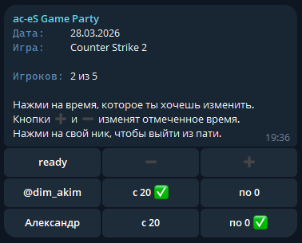

# gameparty-bot
Telegram бот для сбора игрового пати из участников чата.

## Доступные команды
- `/ready` - Сигнал о готовности играть
- `/unready` - Отмена готовности играть
- `/party` - Показать собравшееся игровое пати
- `/help` - Справка по всем доступным командам

Первые три команды поддерживают дополнительные параметры, которые можно указать через пробел. Эти параметры
будут распознаваться по словарю терминов, заданному в файле `aliases.json`. Там же в поле `default` указаны значения
по умолчанию, которые будут применяться при вызове команд без параметров.
Исходные значения: игра - `Counter Strike 2`, день игры - `текущий календарный`.

## Команда /ready
В качестве дополнительных параметров можно указать саму игру, день игры, время, с которого игрок готов начать, 
и продолжительность игры. Например, команда `/ready кс завтра с 7 на пару часиков` будет распознана следующим образом:
- `кс` - игра Counter Strike 2
- `завтра` - завтрашний календарный день
- `7` - время начала 19 часов вечера
- `пару часиков` - время игры 2 часа
- предлоги `с` и `на` будут отброшены

## Команда /unready
В качестве дополнительных параметров можно указать игру и день игры. Время и продолжительность будут проигнорированы.

## Команда /party

Показывает игру, кнопку `ready`, управляющие кнопки `➕` и `➖` и текущих отметивших готовность игроков.
Каждый игрок показан одним рядом inline-кнопок. В первой кнопке написан `username` игрока в Telegram,
а затем следуют 2 кнопки, обозначающие период готовности:`с <число>` и `по <число>`, где `<число>` обозначает час.

При нажатии на кнопку со временем на кнопке появится галочка, показывающая, что это время можно менять
с помощью **управляющих кнопок**.

Для отмены готовности нужно нажать на кнопку с `username` игрока.

Нажатие кнопки `ready` добавит в игровое пати игрока, если его там еще нет.

## Идеи
- Просмотр текущих и добавление новых alias'ов по команде /alias
- Сделать описание деплоя
- Удаление из базы бота пати прошедших дней
